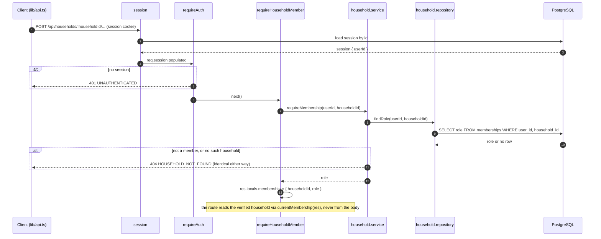
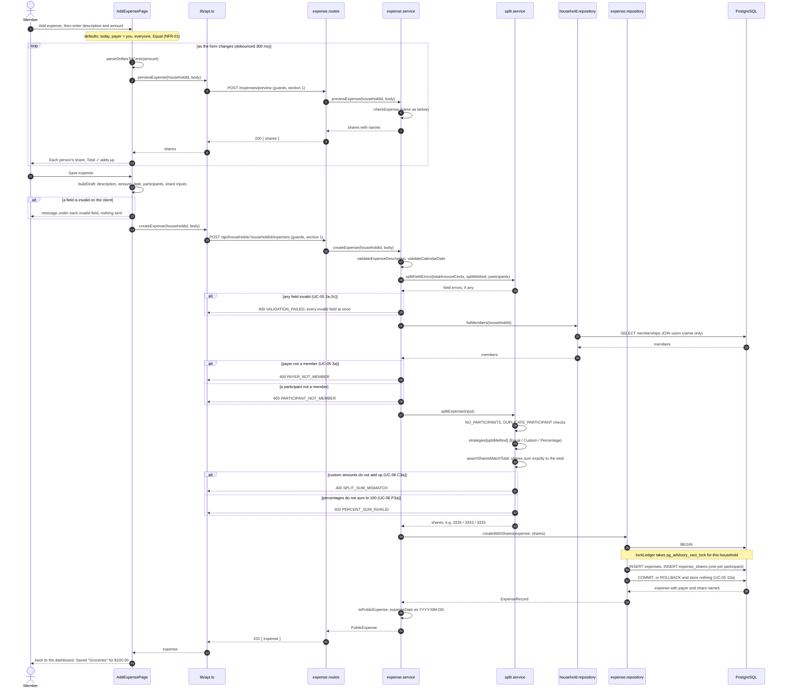
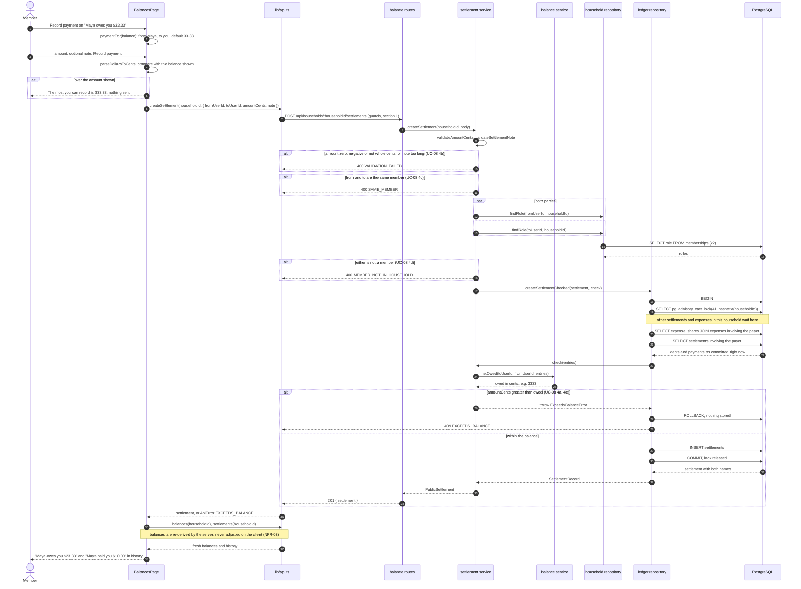

# Component Designs

RoomSync — Software Design and Development
Issue #20 · Milestone 1 deliverable

Component-level designs for two use cases, traced through every layer from
the browser to PostgreSQL:

- **UC-05 Record Shared Expense** (with UC-06 Split Expense) — the write with
  the most rules in the system, and the one SC-04's exact-to-the-cent
  requirement rests on.
- **UC-08 Record Settlement** — the write whose correctness depends on what
  other requests are doing at the same moment.

Both follow ADR-001's layering, with cross-cutting concerns in `middleware/`:

    Client → Routes → Services → Repositories → PostgreSQL

The diagrams name the real modules and functions. Both are on `main`:
Create Expense from #47 and #50, Record Settlement and the ledger lock both
flows take from #54. The module layout itself is in
[module-structure.md](./module-structure.md).

---

## 1. Shared request path

Every household-scoped request passes through the same middleware chain before
its route runs. It is drawn once here and abbreviated as **guards** in the two
diagrams below.

Errors from any step are thrown as an `AppError` subclass and rendered by
`error-handler`, the last middleware, into the contract's single shape:
`{ "error": { "code", "message", "fields"? } }`. No route or service builds an
error body itself.

---

## 2. UC-05 — Record Shared Expense

`POST /api/households/:householdId/expenses`, preceded by previews from
`POST /api/households/:householdId/expenses/preview` while the form is filled in.

### 2.1 Components

| Component | Layer | Role in this use case |
|---|---|---|
| `pages/AddExpensePage.tsx` | Client | The form; checks fields before sending; shows the preview |
| `lib/money.ts` | Client | "12.34" → 1234 cents, from the digits, never through a float (FR-18) |
| `lib/api.ts` | Client | `previewExpense`, `createExpense`; turns error responses into `ApiError` |
| `routes/expense.routes.ts` | Route | Picks the six body fields; calls the service; sets 200 or 201 |
| `services/expense.service.ts` | Service | `checkExpense`: field validation, membership of payer and participants, then the split |
| `services/split.service.ts` | Service | `splitExpense`: the Strategy per split method, then the sum check |
| `services/validation.ts` | Service | `validateExpenseDescription`, `validateCalendarDate`, `validateAmountCents` |
| `repositories/household.repository.ts` | Repository | `listMembers`: who may pay and participate, with names for the response |
| `repositories/expense.repository.ts` | Repository | `createWithShares`: the expense and its shares in one transaction |

### 2.2 Sequence

Every `alt` branch returns before anything below it runs: an expense that fails
any check reaches neither `splitExpense` nor the database.

### 2.3 Design decisions

**The split is calculated only on the server.** The preview endpoint runs the
exact checks that create runs — both call `checkExpense` — and writes nothing.
So what the member reviews (UC-05 step 7) is what gets stored, and the
splitting rules exist in one place.

**Checks run cheapest and most specific first.** Field errors are collected and
reported together before any database read, so a form shows every mistake at
once. Membership costs one query, which also supplies the names the response
needs. Only an expense that passes both reaches the split.

**The sum check is unconditional** (UC-05 9a). `assertSharesMatchTotal` runs
after whichever strategy was used, even though the server calculated the shares
itself. If it ever fails, that is a bug in a strategy, so it is a 500 that
stores nothing — not a 400 blaming the member.

**One transaction for the expense and its shares** (UC-05 10a). An expense with
only some of its shares would silently corrupt every balance derived from it.

**Money stays integer from keyboard to column.** The client converts dollars to
cents from the digits; every server value is an integer number of cents; the
columns are `INTEGER`. No float appears anywhere in the path (FR-18).

---

## 3. UC-08 — Record Settlement

`POST /api/households/:householdId/settlements`, from the Balances page.

### 3.1 Components

| Component | Layer | Role in this use case |
|---|---|---|
| `pages/BalancesPage.tsx` | Client | Each balance with Record payment; the form; reloads balances after a write |
| `lib/balances.ts` | Client | `paymentFor`: who pays whom, and the full outstanding amount as the default |
| `lib/api.ts` | Client | `createSettlement`, `balances`, `settlements` |
| `routes/balance.routes.ts` | Route | Picks the four body fields; calls the service; sets 201 |
| `services/settlement.service.ts` | Service | Validation, same-member and membership checks; the balance rule passed into the write |
| `services/balance.service.ts` | Service | `netOwed`: how much one member owes another, from the ledger rows |
| `repositories/household.repository.ts` | Repository | `findRole` for each party |
| `repositories/ledger.repository.ts` | Repository | `createSettlementChecked`: lock, read, check, insert in one transaction |

### 3.2 Sequence

On `EXCEEDS_BALANCE` the page takes the same reload path, and shows "Nothing was
recorded… the balance has changed" above the balance, which now reflects the
payment that got there first.

### 3.3 Design decisions

**The balance is checked at the moment of writing, not when it was displayed**
(UC-08 4e). The page's number can be stale — another tab may have recorded a
payment, or someone added an expense. The service passes its rule into the
repository as `check`, and the repository runs it inside the transaction,
after the lock, against the rows as they are then.

**A per-household advisory lock serialises ledger writes.** Without it, two
payments that each fit could both pass their check before either commits, and
together exceed the debt. With it, the second waits, then reads the first and
is refused: five simultaneous $10 payments against a $33.33 debt give exactly
three successes and two `EXCEEDS_BALANCE`. Expense creation takes the same lock,
because a new expense can change the same balance. It is transaction-scoped, so
it is released at commit or rollback and cannot be left held.

**Read committed, not serializable.** A serializable snapshot is taken before
the lock is granted, so it would read the ledger as it was before the
transaction it waited for — and under load it failed with raw `40001` errors
instead of a 409. The lock provides the ordering; read committed lets each
statement see what the previous holder committed.

**The rule stays in the service.** `netOwed` is a pure function in
`balance.service`; the repository only knows "run this check inside the
transaction". No business rule moves into the data layer, and no repository
calls a service.

**Settlements are records, never adjustments.** Recording one changes no
expense and stores no balance; it adds a row that `netOwed` subtracts. The row
stays after the balance reaches zero, which is why the history still shows it
(FR-12).

---

## 4. Consistency with the API contract

Every endpoint, status and code in the diagrams, checked against
`docs/design/api-contract.md` Sections 3-5.

### Create Expense

| Contract | In the design |
|---|---|
| `POST /api/households/:householdId/expenses/preview`, 200 `{ shares }`, writes nothing | §2.2 loop; same `checkExpense`, no repository write |
| `POST /api/households/:householdId/expenses`, 201 `{ expense: ExpensePublic }` | §2.2 final steps; `toPublicExpense` |
| Auth: required, member | Guards, §1 |
| 400 `VALIDATION_FAILED` with fields description, totalAmountCents, expenseDate, splitMethod, participants | `checkExpense` + `splitFieldErrors` |
| 400 `NO_PARTICIPANTS`, `DUPLICATE_PARTICIPANT` | `splitExpense` |
| 400 `PAYER_NOT_MEMBER`, `PARTICIPANT_NOT_MEMBER` | After `listMembers` |
| 400 `SPLIT_SUM_MISMATCH`, `PERCENT_SUM_INVALID` | Custom and Percentage strategies |
| Shares sum exactly to the total, checked unconditionally | `assertSharesMatchTotal` |
| Expense and all shares in one transaction | `createWithShares` |
| Money as integer cents; dates as `YYYY-MM-DD` | `lib/money.ts`; `toPublicExpense` |

### Record Settlement

| Contract | In the design |
|---|---|
| `POST /api/households/:householdId/settlements`, body `{ fromUserId, toUserId, amountCents, note? }`, 201 `{ settlement: SettlementPublic }` | §3.2 |
| Auth: required, member | Guards, §1 |
| 400 `VALIDATION_FAILED` with fields amountCents, note | `validateAmountCents`, `validateSettlementNote` |
| 400 `SAME_MEMBER` | Before any query |
| 400 `MEMBER_NOT_IN_HOUSEHOLD` | After `findRole` for both parties |
| 409 `EXCEEDS_BALANCE`; balance recomputed at write time inside the same transaction; any amount refused if `from` owes `to` nothing | `createSettlementChecked` with `netOwed` |
| Balances derived, never stored (NFR-03) | The page refetches `GET /balances` after every write |
| Settlements stay listed after the balance reaches zero | `GET /settlements` returns every row |
