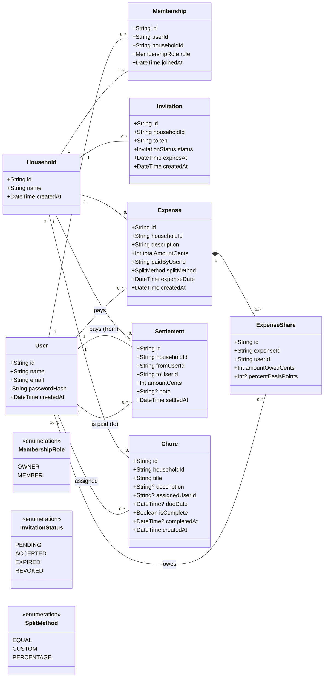
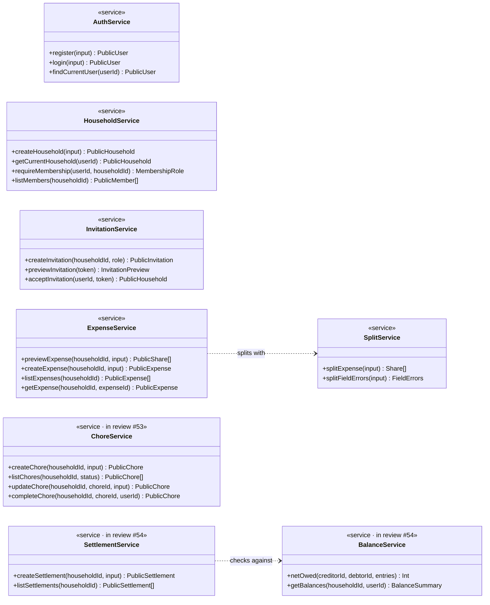
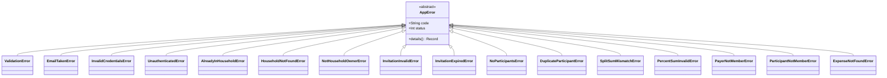

# Design Classes

RoomSync — Software Design and Development
Issue #18 · Milestone 1 deliverable

The classes the system is built from: the domain entities with their typed
attributes, the services that hold the operations on them, the design
decisions behind that split, and the two design patterns it uses. How these
are arranged into layers, and which may call which, is in
[module-structure.md](./module-structure.md).

Entity attributes match `server/prisma/schema.prisma`. Operations match the
exported functions in `server/src/services/`. Everything described is merged on
`main` except chores (#53) and balances and settlements (#54), which are in
review and marked as such.

---

## 1. Domain entities

Eight entities. Every one except `User` belongs to exactly one `Household`,
which is what lets household scoping be enforced in one place: a member can
reach a household's data only through a `Membership`.

`+` marks a public member. Entities are plain records with no behaviour of
their own — the operations on them live in the services (section 2), which is
deliberate; see decision D2.



`passwordHash` is marked private (`-`): it is stored, but no type that leaves
the repository layer carries it, and no API response includes it (NFR-07).

**Attribute rules the types alone do not show:**

| Attribute | Rule | Where enforced |
|---|---|---|
| Every `*Cents` field | Integer cents, never a float or decimal (FR-18) | Schema type `Int`; `validateAmountCents` |
| `percentBasisPoints` | Integer basis points, 10000 = 100%; set only on PERCENTAGE shares | `split.service` |
| `ExpenseShare` amounts | Sum exactly to the expense's `totalAmountCents` (SC-04) | `split.service`, checked before every write |
| `User.email` | Unique, stored lowercased and trimmed | Unique index; `normalizeEmail` |
| `Membership (userId, householdId)` | A user joins a household at most once | Unique index |
| `Invitation.token` | 32 random bytes, base64url; unique | `invitation.service`; unique index |
| `Settlement.amountCents` | No more than the payer owes the recipient at write time | `settlement.service`, inside the write's transaction |
| `Chore.completedAt` | Set once, when completed; never overwritten | `chore.repository.markComplete` |

There is **no Balance entity**. A balance is derived from `ExpenseShare` and
`Settlement` rows each time it is requested (decision D4).

The `session` table is infrastructure, not a domain class: it is owned by the
session middleware's store, and no business rule reads it.

---

## 2. Service classes

Each service is a module of functions rather than a class with state, but it is
a class in the design sense: a cohesive set of public operations over the
entities above. All operations are asynchronous except where noted; return
types are the public shapes from the API contract, Section 2.



`splitExpense`, `splitFieldErrors` and `netOwed` are synchronous and pure — no
I/O at all — which is what lets the money arithmetic be tested exhaustively
without a database.

### Errors

Every business rule a request can break is a subclass of one abstract class,
in `services/errors.ts`:



Chores (#53) add `AssigneeNotMemberError`, `ChoreNotFoundError`,
`ChoreAlreadyCompleteError` and `ChoreNotAssignedToYouError`; settlements (#54)
add `SameMemberError`, `MemberNotInHouseholdError` and `ExceedsBalanceError`.
Each carries the `code` and HTTP `status` from the API contract's error
catalog, and the single error handler renders any of them without knowing
which one it is.

---

## 3. Design decisions

Each states what was chosen, what it was chosen over, and what it costs.

| # | Decision | Over | Why | Cost |
|---|---|---|---|---|
| D1 | **Layered modular monolith:** routes → services → repositories (ADR-001) | Feature folders with mixed concerns; separate services | One deployable a two-person team can run locally; a single place each kind of rule lives | Three files per feature instead of one; a simple read passes through three layers |
| D2 | **Entities are plain records; operations are service functions** | Rich domain classes with methods; Active Record | Services are stateless, so a function is the whole of it. Tests replace a module with `vi.mock` instead of building objects through constructor injection | Behaviour is not discoverable from the entity; you find it by reading the service |
| D3 | **Repositories declare their own record types** (`UserRecord`, `ExpenseRecord`, …) | Passing Prisma's generated types upward | Services depend on types the project owns, so changing the ORM changes one layer | Some mapping code per repository |
| D4 | **No stored balance:** balances derived from shares and settlements on every request (NFR-03) | A running-total column updated on each write | A stored total is a second source of truth that drifts the first time a write half-fails | Computed per request; bounded by reading only the rows involving the requester (NFR-02) |
| D5 | **Money as integer cents, percentages as integer basis points** (FR-18) | `Decimal` or floating point | Shares must sum exactly to the total (SC-04); integer arithmetic can promise that, floats cannot | Conversion at the edges: the client turns "12.34" into 1234 |
| D6 | **The server is the only place shares are calculated;** the client previews through `POST /expenses/preview` | Splitting in the browser for instant feedback | What the member reviews is exactly what is stored; the rule lives once | A request per preview (debounced) |
| D7 | **One household per user is a service rule,** not a database constraint | `@@unique(userId)` on Membership | The post-MVP multiple-households feature becomes a code change, not a migration | The check and the insert are two steps; two creates in the same instant could both pass (recorded in the product brief) |
| D8 | **Non-members get 404, not 403** | 403 Forbidden | The API never confirms that someone else's household, expense or chore exists | A 404 can look like a bug while debugging |
| D9 | **Errors are a class hierarchy carrying their own code and status** | Each route building its error body | One error handler renders every error in the contract's single shape; a new error cannot drift from it | Every new code is a new class in one shared file |
| D10 | **Ledger writes take a per-household lock** (`lockLedger`) — #54 | SERIALIZABLE transactions with retries | Two payments that together exceed a debt cannot both succeed, and each request gets a definite answer instead of a retryable failure | Ledger writes in one household happen one at a time — acceptable at household scale |

---

## 4. Design patterns

Two patterns, both in use.

### 4.1 Repository

**Where:** `server/src/repositories/` — `user.repository.ts`,
`household.repository.ts`, `invitation.repository.ts`,
`expense.repository.ts`, and in review `chore.repository.ts` (#53) and
`ledger.repository.ts` (#54). `prisma.ts` holds the shared client.

**What it is:** these modules are the only ones that touch the database. Each
exposes intention-named operations — `findByEmail`, `createWithOwner`,
`acceptIntoHousehold`, `createWithShares` — over record types it declares
itself, and hides how they are stored.

**Why here:** the business rules most in need of exhaustive tests — splitting
to the cent, balance arithmetic, membership checks — then run without a
database. `expense.service.test.ts` and `household.service.test.ts` replace
the repository modules and test every rule in milliseconds. Repositories also
translate database failures into their own errors (`UniqueConstraintError`
from Prisma's `P2002`), so a database error code never reaches a service.

**Tradeoff:** more files and a mapping step per query, accepted in ADR-001 in
exchange for one place where data access, and therefore household scoping,
happens.

### 4.2 Strategy

**Where:** `server/src/services/split.service.ts`.

**What it is:** the three split methods are interchangeable algorithms behind
one signature:

```ts
type SplitStrategy = (totalCents: number, participants: SplitParticipant[]) => Share[];

const strategies: Record<SplitMethod, SplitStrategy> = {
  EQUAL: splitEqually,
  CUSTOM: splitByAmount,
  PERCENTAGE: splitByPercentage,
};
```

`splitExpense` validates what all three share, picks the strategy from the
request's `splitMethod`, and then checks the result — the shares must sum
exactly to the total — whichever strategy ran.

**Why here:** each method has different edge cases (remainder cents in equal
splits, sums that must match in custom splits, basis-point rounding in
percentage splits), so each is tested on its own. The shared guarantee is
asserted once, outside the strategies, so a bug in any one of them fails the
request rather than storing an expense whose shares do not add up. Adding a
fourth method — by shares, say — is one function and one entry in the table.

**Tradeoff:** an indirection where a `switch` would also work for three
cases. It is worth it here because the post-condition must apply to every
method, and keeping it outside the algorithms is what guarantees that.

---

## 5. Traceability

| Requirement | Satisfied by |
|---|---|
| FR-01, FR-02 accounts | `AuthService`, `User` |
| FR-04 – FR-06 households, roles | `HouseholdService`, `Membership`, `MembershipRole` |
| US-04 invitations | `InvitationService`, `Invitation`, `InvitationStatus` |
| FR-07 – FR-10 expenses and splitting | `ExpenseService`, `SplitService` (Strategy), `Expense`, `ExpenseShare` |
| FR-11, FR-12 settlements | `SettlementService`, `Settlement` (#54) |
| FR-13 – FR-15 chores | `ChoreService`, `Chore` (#53) |
| FR-18 integer money | D5; every `*Cents` field |
| NFR-03 derived balances | D4; `BalanceService.netOwed` (#54) |
| NFR-06, NFR-07 authorization | `HouseholdService.requireMembership`; D8 |
| SC-04 exact splitting | `SplitService`'s post-condition |
