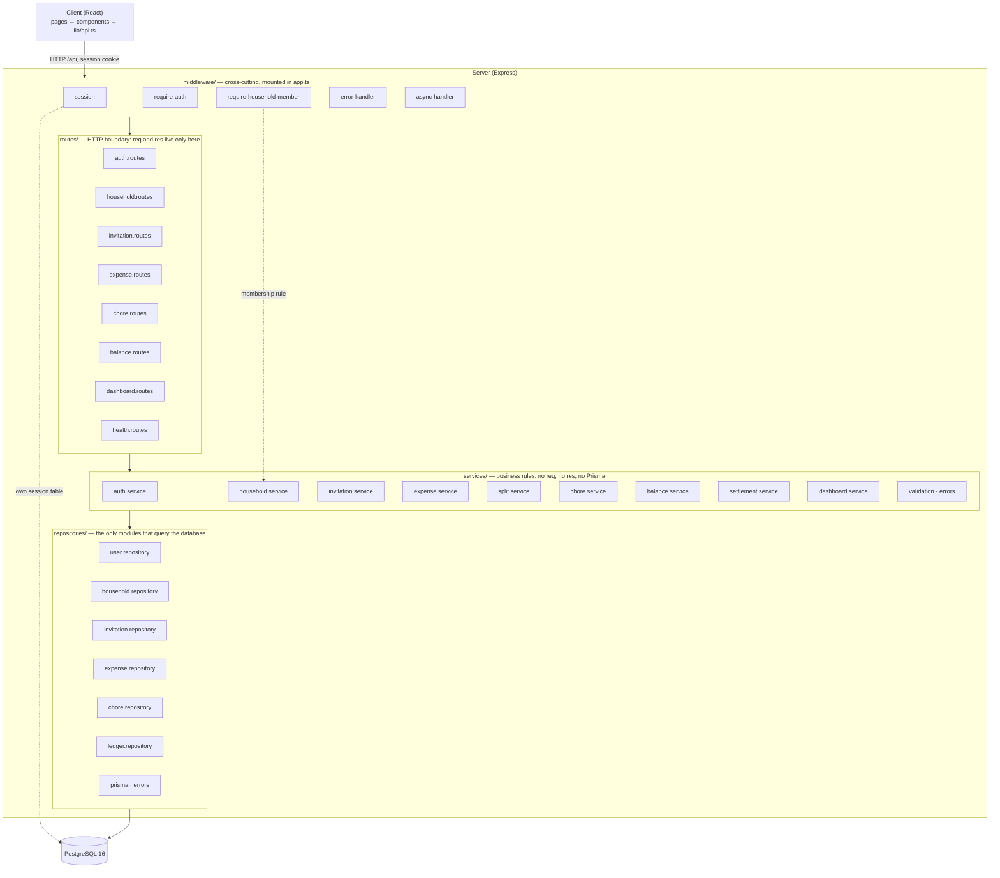
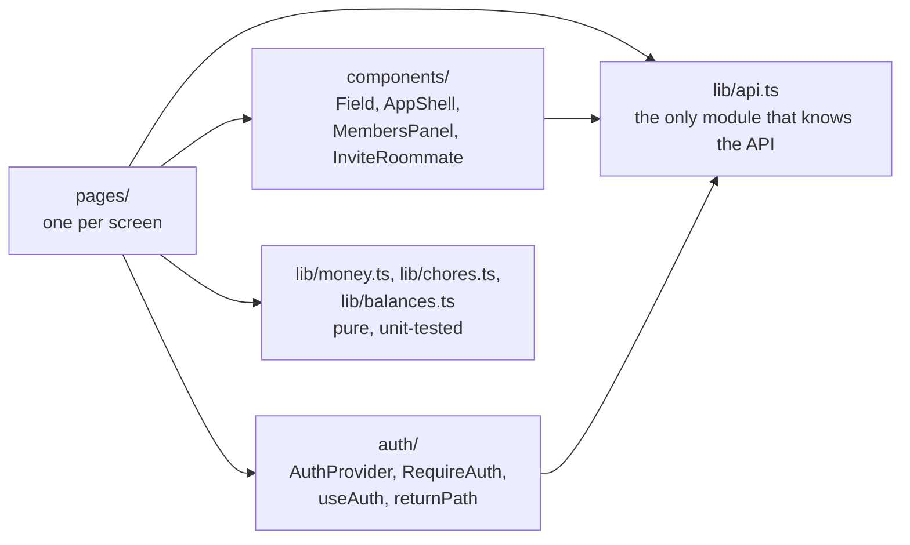

# Module Structure

RoomSync — Software Design and Development
Issue #18 · Milestone 1 deliverable

How the code is divided into modules, which module may call which, and how to
check that the rules hold. The classes inside these modules are described in
[design-classes.md](./design-classes.md); the reasoning for the layering itself
is ADR-001.

Everything below is on `main`.

---

## 1. Module boundary diagram

Requests enter through the middleware chain, are handled by a route, which
calls a service, which calls repositories. Responses and errors go back the
same way; every error is rendered by `error-handler`, the last middleware.

---

## 2. What each layer may depend on

| Layer | May import | Must not import |
|---|---|---|
| `routes/` | services, middleware | repositories, `@prisma/client` |
| `services/` | repositories, other services | routes, middleware, Express (`req`, `res`) |
| `repositories/` | `prisma.ts`, other repositories, `@prisma/client` | services, routes |
| `middleware/` | services (for rules), Express | repositories |

**The rule (ADR-001):** a layer calls the layer directly beneath it, and never
a layer above it. Calls *within* a layer are allowed where one module
genuinely builds on another. The ones that exist:

| From | To | Why |
|---|---|---|
| `expense.service` | `split.service` | Splitting is its own rule set (the Strategy pattern), used by preview and create |
| `settlement.service` | `balance.service` | A settlement is checked against the same `netOwed` arithmetic balances use |
| `dashboard.service` | `household`, `balance`, `chore`, `expense`, `settlement` services | The dashboard is a view over the other features, so it composes their services rather than querying again, and cannot disagree with their screens |
| `expense.service`, `invitation.service`, `chore.service`, `balance.service`, `settlement.service` | `household.repository` | Membership checks and member names |
| `expense.repository` | `ledger.repository` | Expense creation takes the same per-household ledger lock as settlements |
| `require-household-member` (middleware) | `household.service` | The membership rule is a business rule; the middleware only connects it to the request |

### The one exception

`middleware/session.ts` configures `connect-pg-simple`, which runs its own SQL
against the `session` table. That is a library managing its own storage, not
application data access: nothing in the application reads that table, and the
`Session` model is declared in the Prisma schema so migrations own it. The
reasoning is in `server/src/repositories/README.md`.

---

## 3. The rules as checks

Written as commands so they can be run rather than trusted. Since #69, the
server rules are also enforced by `npm run lint` in `server/`, which CI runs on
every pull request, so a violation fails the build rather than waiting for
someone to run a command. The **Lint** column says which. The rules and the
evidence are in `docs/architecture/layering-lint.md`.

| Rule | Command | Expected | Lint |
|---|---|---|---|
| Only repositories import Prisma | `grep -rl "@prisma/client" server/src --include=*.ts \| grep -v "^server/src/repositories/"` | nothing | Yes |
| Services never touch HTTP | `grep -rnE "\b(req\|res)\." server/src/services` | nothing | Partly: services may not import Express |
| Routes never reach a repository | `grep -rn "repositories/" server/src/routes --include=*.ts \| grep -v "\.test\.ts"` | nothing | Yes |
| Repositories never call upward | `grep -rnE "from \"\.\./(services\|routes)/" server/src/repositories` | nothing | Yes |
| Services never import routes or middleware | `grep -rnE "from \"\.\./(routes\|middleware)/" server/src/services` | nothing | Yes |
| Pages never call `fetch` directly | `grep -rn "fetch(" client/src/pages` | nothing | No |

Route test files are excluded from the third check because they mock
repositories, which is how they run without a database — they do not call
them.

---

## 4. Server modules

### routes/
| Module | Endpoints |
|---|---|
| `health.routes` | `GET /health` |
| `auth.routes` | register, login, logout, me |
| `household.routes` | create, current, members |
| `invitation.routes` | create invitation, preview, accept |
| `expense.routes` | preview, create, list, get one |
| `chore.routes` | create, list, edit, complete |
| `balance.routes` | balances; create and list settlements |
| `dashboard.routes` | the whole dashboard in one response |

Each handler reads the body, calls one service function, and sets the status.
None builds an error body or touches the database.

### services/
`auth`, `household`, `invitation`, `expense`, `split`, `chore`, `balance`,
`settlement` and `dashboard` — their operations are in
[design-classes.md §2](./design-classes.md#2-service-classes). Alongside them:

- `validation.ts` — pure field validators returning a message or `null`, so a
  caller can collect every field's error and report them together.
- `errors.ts` — the `AppError` hierarchy, the one place a `code` and HTTP
  `status` are attached.

### repositories/
| Module | Owns |
|---|---|
| `prisma.ts` | The Prisma client, created on first use so importing a route needs no database |
| `errors.ts` | `UniqueConstraintError` and `isUniqueViolation` (Prisma `P2002`) |
| `user.repository` | Users |
| `household.repository` | Households and memberships |
| `invitation.repository` | Invitations, and accepting one atomically with the new membership |
| `expense.repository` | Expenses with their shares, written in one transaction |
| `chore.repository` (#53) | Chores; completion and edits only touch outstanding chores |
| `ledger.repository` (#54) | The rows balances are derived from, settlements, and the per-household ledger lock |

### middleware/
| Module | Responsibility |
|---|---|
| `session` | Cookie settings and the PostgreSQL-backed session store |
| `require-auth` | 401 without a session; `currentUserId(req)` |
| `require-household-member` | 404 for non-members of the household in the URL; `currentMembership(res)` |
| `error-handler` | The only place an error becomes a response body |
| `async-handler` | Forwards async rejections to the error handler (Express 4 does not) |

---

## 5. Client modules

- **`lib/api.ts` is the client's equivalent of the repository layer**: every
  request goes through it, and it turns any non-2xx response into an
  `ApiError` carrying the contract's `code` and `fields`. Pages branch on
  `code`, never on `message`.
- **Pure logic lives in `lib/` and has tests**: money parsing and formatting,
  due-date labels (#53), and the wording and direction of balances (#54).
- **`RequireAuth` is convenience, not access control.** It decides which
  screen to show; what protects data is `requireAuth` and
  `requireHouseholdMember` on the server.

---

## 6. Adding a feature

The shape every feature so far has followed, US-10 included, and the one US-11 will:

1. Endpoint and error codes in the API contract first.
2. A repository function for each query, returning a record type declared in
   that repository.
3. A service function holding the rules, tested with the repository mocked.
4. A route that calls it behind `requireAuth` and, for household data,
   `requireHouseholdMember`; mounted in `app.ts`.
5. Any new error as an `AppError` subclass in `services/errors.ts`.
6. On the client: a method in `lib/api.ts`, pure helpers in `lib/` with tests,
   and a page.

---

## 7. Known boundary weaknesses

- **Lint sees imports, not behavior.** Since #69 the server lint fails any
  import that crosses a layer, but a service handed `req` as an argument, or a
  page calling `fetch`, still needs the grep checks in section 3 and review.
- **`services/errors.ts` and `lib/api.ts` are shared files every feature
  appends to**, so parallel branches conflict there. The conflicts are always
  "keep both" — the cost of keeping each catalog in one place.
- **`validation.ts` holds validators for every domain.** Fine at this size; the
  natural split is per feature once it becomes hard to navigate.
- **The client has no data layer between pages and `lib/api.ts`.** Each page
  loads what it needs. The dashboard, the one screen that draws on every
  feature, avoided needing one by composing on the server instead: one
  `GET /dashboard` call, assembled by `dashboard.service` from the other
  services. A shared hook layer would earn its place once several pages need
  the same data kept in sync.
