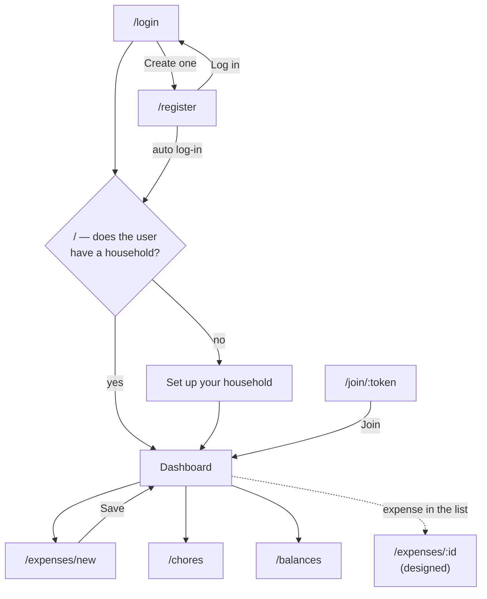

# UX Wireframes

RoomSync — Software Design and Development
Issue #5 · Milestone 1 deliverable

Wireframes for every MVP screen. Screens that are built are drawn as they
actually render, so this document describes the product rather than an
intention; the one screen not yet built, expense detail, is drawn as the
design it will be built to.

Drawn at desktop width. Every screen is a single column at 375px (NFR-05); the
**At 375px** note under each one says what changes, if anything.

---

## 1. Screen index

Status as of September 30, 2026.

| # | Screen | Route | Story | Status |
|---|---|---|---|---|
| 2 | Log in | `/login` | US-02 | Built |
| 3 | Create account | `/register` | US-01 | Built |
| 4 | Set up your household | `/` (no household) | US-03 | Built |
| 5 | Join a household | `/join/:token` | US-04 | Built |
| 6 | Dashboard | `/` | US-10 | Built in part — members, invitations, links; balance, chores and activity panels are placeholders |
| 7 | Add an expense | `/expenses/new` | US-05, US-06 | Built |
| 8 | Expenses list | dashboard panel | US-05, US-11 | In review (#52) |
| 9 | Expense detail | `/expenses/:id` | US-05, US-11 | Designed, not built |
| 10 | Chores | `/chores` | US-09 | In review (#53) |
| 11 | Balances and record payment | `/balances` | US-07, US-08 | In review (#54) |

Together these cover the screen list in #5: register, login, create or join a
household, dashboard, expenses, expense detail, and chores — plus balances,
which UC-07 and UC-08 need and the original list predates.

### Screen map



Two routing rules shape the map:

- **Signed-out visitors are sent to log in and brought back.** Opening an
  invitation link while signed out goes to `/login`, and after logging in — or
  creating an account from there — the visitor lands back on the invitation
  (UC-04 step 7).
- **The root route asks the server which screen applies.** Belonging to no
  household is a normal answer (`200 { household: null }`), so `/` shows the
  set-up screen rather than an error.

Every signed-in screen shares one header:

```
┌──────────────────────────────────────────────────────────────┐
│  RoomSync                                  Agustin  [Log out]│
└──────────────────────────────────────────────────────────────┘
```

**At 375px:** the header wraps rather than squeezing — the brand on one line
and the name and Log out below it if they do not fit — so Log out is always
reachable.

---

## 2. Log in — Built

```
┌──────────────────────────────────────────────┐
│                   Log in                     │
│                                              │
│     ┌────────────────────────────────┐       │
│     │ Invalid email or password.     │ ◀─ role="alert", only on failure
│     └────────────────────────────────┘       │
│     Email                                    │
│     ┌────────────────────────────────┐       │
│     └────────────────────────────────┘       │
│     Password                                 │
│     ┌────────────────────────────────┐       │
│     └────────────────────────────────┘       │
│     ┌────────────────────────────────┐       │
│     │            Log in              │       │
│     └────────────────────────────────┘       │
│                                              │
│      No account yet? Create one              │
└──────────────────────────────────────────────┘
```

The credentials error sits **above the form**, not under a field: attaching it
to the password field would tell someone guessing that the email was right,
undoing the server's work to make the two cases indistinguishable.

**At 375px:** the form is already a 380px-max single column, so it fills the
width with 16px margins. Inputs use 16px text so iOS Safari does not zoom in
on focus.

---

## 3. Create account — Built

```
┌──────────────────────────────────────────────┐
│             Create your account              │
│                                              │
│     ┌────────────────────────────────┐       │
│     │ Registration could not be      │ ◀─ 409, deliberately vague
│     │ completed.                     │       │
│     └────────────────────────────────┘       │
│     Name                                     │
│     ┌────────────────────────────────┐       │
│     └────────────────────────────────┘       │
│     Email                                    │
│     ┌────────────────────────────────┐       │
│     └────────────────────────────────┘       │
│       Enter a valid email address.    ◀─ per field, from the
│     Password                                 │  contract's `fields` map
│     ┌────────────────────────────────┐       │
│     └────────────────────────────────┘       │
│     At least 8 characters.                   │
│     ┌────────────────────────────────┐       │
│     │        Create account          │       │
│     └────────────────────────────────┘       │
│                                              │
│      Already have an account? Log in         │
└──────────────────────────────────────────────┘
```

Two error channels: **field errors** under the field the user can fix, all
shown at once, and a **form-level message** for anything else.

**At 375px:** same as Log in — one column, full width.

---

## 4. Set up your household — Built

Shown on `/` when the user belongs to no household.

```
┌──────────────────────────────────────────────┐
│  Set up your household                       │
│                                              │
│  Create a household to start tracking shared │
│  expenses and chores. You can invite your    │
│  roommates once it exists.                   │
│                                              │
│  Household name                              │
│  ┌──────────────────────────────┐            │
│  │ e.g. Apartment 4B            │            │
│  └──────────────────────────────┘            │
│  ┌──────────────────────────────┐            │
│  │      Create household        │            │
│  └──────────────────────────────┘            │
└──────────────────────────────────────────────┘
```

If a household was created in another tab meanwhile, the server answers
`ALREADY_IN_HOUSEHOLD` and the page shows that household's dashboard instead
of an error the user cannot act on.

**At 375px:** one column, full width.

---

## 5. Join a household — Built

Where an invitation link lands. Nothing is joined on page load: the recipient
sees the household's name and confirms (UC-04 step 8).

```
┌──────────────────────────────────────────────┐
│  Join Apartment 4B?                          │
│                                              │
│  You have been invited to share expenses and │
│  chores with this household. The invitation │
│  expires on October 7.                       │
│                                              │
│  ┌───────────────────────┐                   │
│  │ Join Apartment 4B     │   Not now         │
│  └───────────────────────┘                   │
└──────────────────────────────────────────────┘
```

Only the household's name is shown — not its members or anything else —
because a link can be forwarded to someone it was not meant for.

When the invitation cannot be used, the same page explains why:

| Server answer | Heading | Detail |
|---|---|---|
| 404 `INVITATION_INVALID` | This invitation is not valid | It may have been used already. Ask the person who sent it for a new link. |
| 410 `INVITATION_EXPIRED` | This invitation has expired | Invitations last seven days. Ask for a new link. |
| 409 `ALREADY_IN_HOUSEHOLD` | You are already in a household | RoomSync supports one household per person for now. |

Each ends with a "Go to the dashboard" link.

**At 375px:** the Join button and Not now wrap onto two lines if the household
name is long, rather than shrinking the button.

---

## 6. Dashboard — Built in part

```
┌──────────────────────────────────────────────────────────────┐
│  Apartment 4B                                                │
│  Signed in as Agustin · You own this household               │
│                                                              │
│  ┌──────────────────────────────────────────────────────┐    │
│  │ Saved "Groceries" for $100.00.                       │ ◀─ only right after a save
│  └──────────────────────────────────────────────────────┘    │
│  [ + Add expense ]  [ Chores ]  [ Balances ]                 │
│                                                              │
│  ┌───────────────────────────┐  ┌───────────────────────────┐│
│  │ Members                   │  │ Your balance              ││
│  │ Agustin · owner           │  │ (placeholder until US-10) ││
│  │ Orlando                   │  │                           ││
│  │ [ Invite a roommate ]     │◀─ owner only                  ││
│  └───────────────────────────┘  └───────────────────────────┘│
│  ┌───────────────────────────┐  ┌───────────────────────────┐│
│  │ Your chores               │  │ Recent activity           ││
│  │ (placeholder until US-10) │  │ (placeholder until US-10) ││
│  └───────────────────────────┘  └───────────────────────────┘│
└──────────────────────────────────────────────────────────────┘
```

After the owner selects **Invite a roommate**, the Members panel shows the
link to send (UC-04 steps 1-4; RoomSync sends no email in the MVP):

```
│  Send this link to your roommate. It works once and    │
│  expires on Wednesday, October 7.                      │
│  ┌──────────────────────────────────────┐  ┌────────┐  │
│  │ https://…/join/_Lali…JTAIYA          │  │  Copy  │  │
│  └──────────────────────────────────────┘  └────────┘  │
│  Link copied to the clipboard.            ◀─ role="status"
```

The Chores and Balances links arrive with #53 and #54. The three placeholder
panels are labelled rather than hidden, so the screen's final shape is visible:
US-10 fills them with the requester's balances, their upcoming chores, and
recent activity.

**At 375px:** the panels stack in one column (the grid is one column below
768px and two above). The three links wrap. The invitation link and Copy
button share a row where they fit and wrap otherwise.

---

## 7. Add an expense — Built

The most involved screen in the MVP, and the one where the splitting rules
become visible.

```
┌────────────────────────────────────────────────────────┐
│  Add an expense                                        │
│  Apartment 4B                                          │
│                                                        │
│  Description                                           │
│  ┌──────────────────────────────────────┐              │
│  │ Groceries                            │              │
│  └──────────────────────────────────────┘              │
│  Amount ($)                                            │
│  ┌──────────────────────────────────────┐              │
│  │ 100                                  │              │
│  └──────────────────────────────────────┘              │
│  Date                                                  │
│  ┌──────────────────────────────────────┐              │
│  │ 09/30/2026                        📅 │ ◀─ defaults to today
│  └──────────────────────────────────────┘              │
│  Paid by                                               │
│  ┌──────────────────────────────────────┐              │
│  │ Agustin (you)                     ▾  │ ◀─ defaults to you
│  └──────────────────────────────────────┘              │
│  ┌─ Split between ──────────────────────┐              │
│  │ ☑ Agustin (you)                      │ ◀─ everyone, by default
│  │ ☑ Orlando                            │              │
│  │ ☑ Maya                               │              │
│  └──────────────────────────────────────┘              │
│  ┌─ How to split ───────────────────────┐              │
│  │ ◉ Equally                            │              │
│  │ ○ By amount                          │              │
│  │ ○ By percentage                      │              │
│  └──────────────────────────────────────┘              │
│  ┌─ Each person's share ────────────────┐              │
│  │ Agustin                      $33.34  │ ◀─ from the server's
│  │ Orlando                      $33.33  │    preview, recomputed
│  │ Maya                         $33.33  │    as the form changes
│  │ Total               $100.00 ✓ adds up│              │
│  └──────────────────────────────────────┘              │
│  [ Save expense ]   Cancel                             │
└────────────────────────────────────────────────────────┘
```

With **By amount** or **By percentage** selected, a field appears per selected
person, and a line under them says how far the figures are from adding up:

```
│  Agustin (you) owes ($)      Orlando owes ($)          │
│  ┌──────────┐                ┌──────────┐              │
│  │ 40       │                │ 20       │              │
│  └──────────┘                └──────────┘              │
│  $80.00 of $84.01 assigned — $4.01 left to assign      │
```

Decisions this screen embodies:

- **The defaults keep it to four interactions** (NFR-01): Add expense →
  description → amount → Save. Date, payer, participants and split method all
  default sensibly.
- **The preview is the server's arithmetic, not the page's.** Shares come from
  `POST /expenses/preview`, so what the member reviews (UC-05 step 7) is exactly
  what gets stored. $100 three ways is 33.34 / 33.33 / 33.33, and seeing that
  before saving means the "off by a cent" question never comes up afterwards.
- **Amounts are typed in dollars and sent as integer cents** (FR-18). More than
  two decimal places is rejected, not rounded.
- **Save is never disabled.** Pressing it with something wrong shows exactly
  what, under the field concerned; a disabled button gives no reason and is
  harder to reach by keyboard or screen reader.

**At 375px:** every field is full width in one column, and the share preview
is one row per person with the amount right-aligned — never a table.

---

## 8. Expenses list — In review (#52)

The household's expenses, newest first: on the dashboard as a panel, and later
as the full history view of US-11.

```
┌────────────────────────────────────────────────────────┐
│  Expenses                                              │
│  ┌────────────────────────────────────────────────────┐│
│  │ Groceries                                  $100.00 ││
│  │ Sep 30 · paid by Agustin       your share $33.34   ││
│  └────────────────────────────────────────────────────┘│
│  ┌────────────────────────────────────────────────────┐│
│  │ Internet                                    $70.00 ││
│  │ Sep 27 · paid by Orlando           not your split  ││
│  └────────────────────────────────────────────────────┘│
└────────────────────────────────────────────────────────┘
```

**A card per expense, not a table.** Each leads with what the reader wants —
what it was and how much — then the line that matters to them personally.
Selecting one opens the expense detail (screen 9).

**At 375px:** the two lines of each card wrap independently; amounts stay
right-aligned with tabular digits so they line up down the list.

---

## 9. Expense detail — Designed, not built

`GET /api/households/:householdId/expenses/:expenseId` exists (#47); this is
the screen it is for.

```
┌────────────────────────────────────────────────────────┐
│  ← Expenses                                            │
│                                                        │
│  Groceries                                   $100.00   │
│  Paid by Agustin on Tuesday, September 30              │
│  Split equally between 3 people                        │
│                                                        │
│  ┌─ Shares ─────────────────────────────────────────┐  │
│  │ Agustin (paid)                          $33.34   │  │
│  │ Orlando                                 $33.33   │  │
│  │ Maya                                    $33.33   │  │
│  │ Total                                  $100.00   │  │
│  └──────────────────────────────────────────────────┘  │
└────────────────────────────────────────────────────────┘
```

For a percentage split each row also shows the percentage
(`Orlando · 60%   $42.00`); for a custom split the heading reads
"Split by amount".

There is no Edit or Delete: expenses are immutable in the MVP, and editing one
after a settlement has been recorded against it would silently change what
that settlement paid off.

If the id does not exist **in this household**, the server answers
404 `EXPENSE_NOT_FOUND`, and the page says "This expense could not be found"
with a link back — the same for an expense in someone else's household.

**At 375px:** one column; the share rows keep name left, amount right.

---

## 10. Chores — In review (#53)

```
┌────────────────────────────────────────────────────────┐
│  Chores                                                │
│  Apartment 4B · Back to the dashboard                  │
│                                                        │
│  ┌─ Add a chore ──────────────────────────────────────┐│
│  │ Title                                              ││
│  │ ┌────────────────────────────────┐                 ││
│  │ │ e.g. Take out bins             │                 ││
│  │ └────────────────────────────────┘                 ││
│  │ Description (optional)                             ││
│  │ Assign to                                          ││
│  │ ┌────────────────────────────────────────┐         ││
│  │ │ Unassigned — anyone can complete it  ▾ │         ││
│  │ └────────────────────────────────────────┘         ││
│  │ Due date (optional)                                ││
│  │ [ Add chore ]                                      ││
│  └────────────────────────────────────────────────────┘│
│                                                        │
│  Outstanding (2)                                       │
│  ┌────────────────────────────────────────────────────┐│
│  │ Take out bins                                      ││
│  │ Assigned to you · ⚠ Overdue by 3 days              ││
│  │ [ Mark complete ]                                  ││
│  └────────────────────────────────────────────────────┘│
│  ┌────────────────────────────────────────────────────┐│
│  │ Clean kitchen                                      ││
│  │ Counters and stovetop                              ││
│  │ Assigned to Maya · Due Fri, Oct 2                  ││
│  │ Only Maya can mark this complete.                  ││
│  └────────────────────────────────────────────────────┘│
│                                                        │
│  Completed (1)                                         │
│  ┌────────────────────────────────────────────────────┐│
│  │ ✓ ~~Vacuum living room~~                           ││
│  │ Completed Wed, Sep 30 · Orlando                    ││
│  └────────────────────────────────────────────────────┘│
└────────────────────────────────────────────────────────┘
```

- **Outstanding and completed are separate sections**, because "what still
  needs doing" is the question the page answers. Completed chores also carry a
  tick, strikethrough and the completion date.
- **Overdue is said in words and an icon**, not colour alone. A past due date is
  accepted when creating a chore (UC-09 4a), since a member may be recording
  one that is already late.
- **Mark complete appears only where it will work**: on chores assigned to the
  viewer, and on unassigned ones. Otherwise the card says who can complete it.
  The server enforces the same rule regardless (403
  `CHORE_NOT_ASSIGNED_TO_YOU`).

**At 375px:** the form and every card are full width in one column.

---

## 11. Balances and record payment — In review (#54)

```
┌────────────────────────────────────────────────────────┐
│  Balances                                              │
│  Apartment 4B · Back to the dashboard                  │
│                                                        │
│  You owe $6.67 · You are owed $33.33                   │
│                                                        │
│  With each roommate                                    │
│  Maya owes you $33.33                [ Record payment ]│
│  ────────────────────────────────────────────────────  │
│  You owe Sam $6.67                   [ Record payment ]│
│  ────────────────────────────────────────────────────  │
│  You and Orlando are settled up                        │
│                                                        │
│  Payments recorded                                     │
│  Maya paid you $10.00                                  │
│  Sep 30 · Venmo                                        │
└────────────────────────────────────────────────────────┘
```

**Record payment** opens a short form under that balance:

```
│  Maya owes you $33.33                                  │
│  Record that Maya paid you. RoomSync does not move     │
│  money; this records a payment made elsewhere.         │
│  Amount paid ($)                                       │
│  ┌──────────────┐                                      │
│  │ 33.33        │ ◀─ the full balance, by default (UC-08 step 3)
│  └──────────────┘                                      │
│  Note (optional)                                       │
│  ┌──────────────────────────┐                          │
│  │ e.g. Venmo               │                          │
│  └──────────────────────────┘                          │
│  [ Record payment ]  [ Cancel ]                        │
```

- **Balances are per person, not one net number.** "You are owed $26.66" would
  hide that you owe Sam; roommates settle pairwise, so the pairs are what they
  act on, and the totals sit above as a summary.
- **Direction is in the sentence** — "owes you", "you owe", "settled up" — never
  colour or sign alone.
- **More than is owed is caught before sending**, showing the most that can be
  recorded; the server refuses it regardless (409 `EXCEEDS_BALANCE`).
- **If the balance changed since the page loaded** — someone recorded a payment
  in another tab — the server refuses the stale amount, the page reloads the
  balances, and a message above the row explains that nothing was recorded
  (UC-08 4e).
- **Payments stay listed after a balance reaches zero** (FR-12).

**At 375px:** each balance sentence and its Record payment button wrap onto
two lines rather than squeezing the sentence; the form is full width.

---

## 12. Patterns across screens

| Pattern | Rule |
|---|---|
| Field errors | Under the field, tied to it with `aria-describedby` and `aria-invalid`, all shown at once |
| Form errors | Above the form, `role="alert"` |
| Lists | A card per record, never a table — tables cannot be read at 375px without horizontal scroll |
| Empty states | Labelled with what will appear, never hidden |
| Money | Dollars on screen, integer cents on the wire (FR-18) |
| Direction and status | Words first — "owes you", "Overdue", "settled up"; colour is decoration on top |
| Submit buttons | Never disabled to signal invalid input; pressing explains what is wrong. Disabled only while a request is in flight |
| Loading | An explicit state with `aria-busy`, never a blank screen |
| Signed out mid-session | Any 401 sends the user to log in, then back to where they were |
| Destructive actions | None in the MVP — expenses and settlements are immutable |

---

## 13. Not covered here

- **Visual design** — colour, type and spacing come from the tokens in
  `client/src/index.css`, in light and dark mode.
- **Editing a chore** — the API supports reassigning and re-dating
  (`PATCH /chores/:id`), but there is no screen for it yet.
- **US-11 history views** beyond the expense list, since that story is P1 and
  scheduled for Sprint 3.
