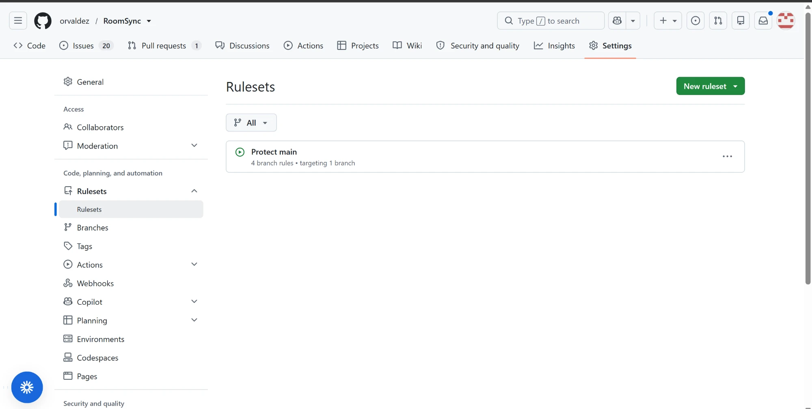

# Branch protection on `main`

Since October 7, 2026, a repository ruleset named **Protect main** enforces the
review step of the Definition of Done (`BACKLOG.md`) on `main`. Before that date
review was a team rule only, and two pull requests (#41 and #52) were merged by
their author without the other member's review (`process-model.md` §7). Tracked
in #64.

## What the ruleset enforces

| Rule | Setting | Why |
|---|---|---|
| Target | The default branch (`main`) | Every change reaches `main` through it |
| Enforcement | Active | |
| Bypass list | Empty, so the rules apply to the repository admin too | The owner merging without review is the failure this prevents |
| Require a pull request before merging | 1 approving review | Peer review per the Definition of Done |
| Dismiss stale approvals on new commits | On | An approval covers the code that was reviewed, not later changes |
| Require conversation resolution | On | Review comments are answered before merge |
| Allowed merge methods | Squash only | The PR title becomes the Conventional Commit on `main` |
| Restrict deletions | On | `main` can't be deleted |
| Block force pushes | On | History on `main` can't be rewritten |
| Require status checks to pass | `server` and `client`, from GitHub Actions | A pull request can't merge until CI (`.github/workflows/ci.yml`, #68) is green |

GitHub does not let a pull request's author approve it, so with two members,
every pull request needs the other member's approval before it can merge.

The required checks were added on October 7, 2026, after the first CI run on
`main`, because GitHub offers a check name only once it has run. Each check is
pinned to the GitHub Actions app, so a status with the same name posted by
anything else doesn't satisfy it. The check names are the job names in
`ci.yml`, so renaming a job means updating the ruleset in the same change. New
jobs, such as the integration tests (#61), aren't required until they are added
here as well.

## Evidence

- [`branch-protection-ruleset.json`](./branch-protection-ruleset.json): the
  ruleset as exported from the GitHub API
  (`gh api repos/orvaldez/RoomSync/rulesets/24678263`), the authoritative record
  of the settings
- Screenshot of the active ruleset in the repository settings:

  

  The screenshot was taken when the ruleset was created, before the status
  checks were added; the export above is current.

## Team practice

- The reviewer clicks **Approve** before merging. Merging is not a substitute
  for approving, because the merge leaves no record that the code was reviewed.
- A pull request that received **Request changes** is reviewed again after the
  changes are made, rather than merged as it stands.
