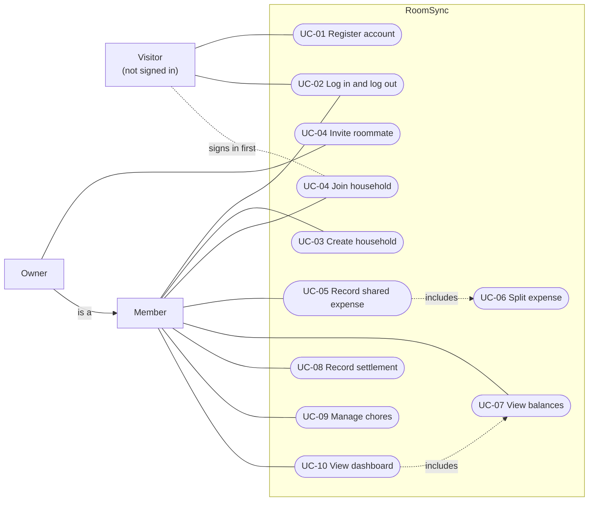
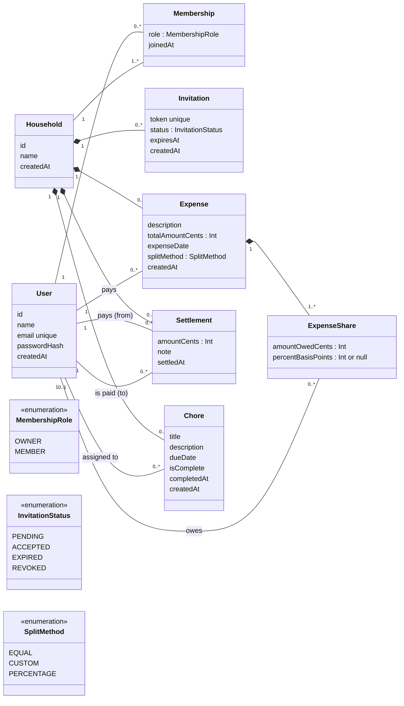
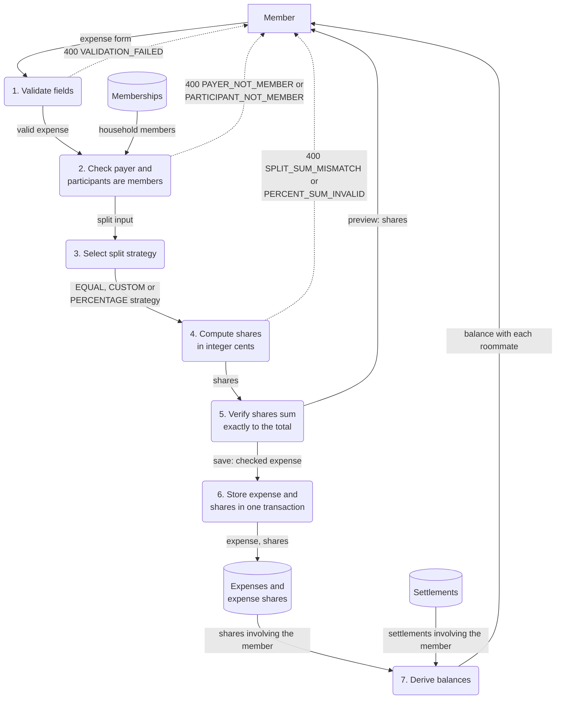
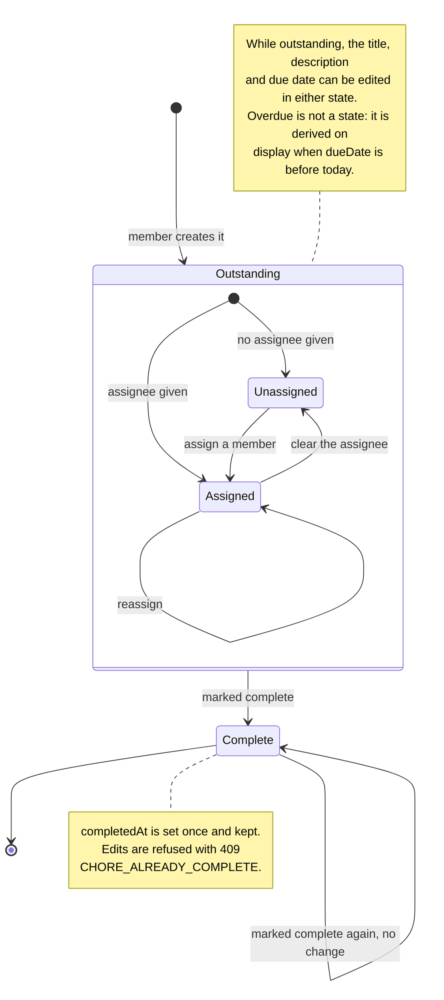
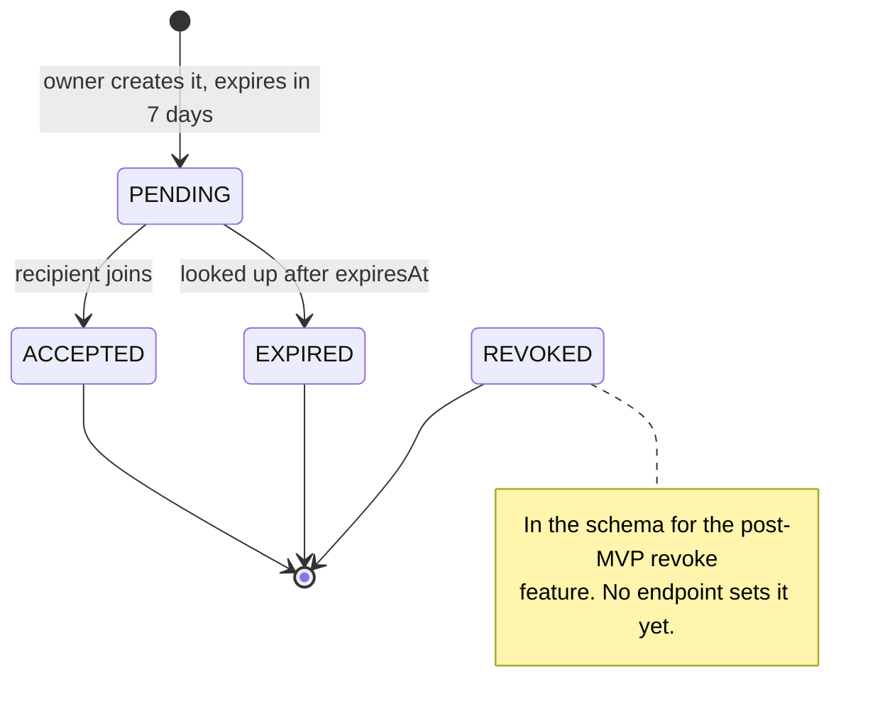

# Analysis Model

RoomSync — Software Design and Development
Issue #17 · Milestone 1 deliverable

The important data and behaviour in the system, in the four views Workshop 3
asks for. Every diagram is Mermaid, so it renders on GitHub and changes in the
same pull request as the code it describes. Entities and relationships match
`server/prisma/schema.prisma` on `main`; behaviours match the services that
implement them.

| View | Section | Diagram |
|---|---|---|
| Scenario-based | §1 Use cases | Use case diagram |
| Class-based | §2 Domain classes | Class diagram |
| Functional | §4 Splitting an expense | Data-flow diagram |
| Behavioral | §6 State | State diagrams for a chore and an invitation |

---

## 1. Scenario-based model: use cases

Three actors. A **Visitor** has no session. A **Member** belongs to a household.
An **Owner** is a Member who created the household, and can do everything a
Member can plus invite people (FR-06). The full specifications, with main
scenarios and extensions, are in [`use-cases.md`](use-cases.md).



Reading it:

- **UC-05 includes UC-06.** Every expense is split when it is recorded; there
  is no unsplit expense.
- **UC-10 includes UC-07.** The dashboard shows the same balances as the
  Balances screen, computed by the same service.
- **A Visitor can open an invitation link** but must register or log in before
  joining (UC-04 step 7). The dotted line marks that hand-off.
- **Create household** is offered only to a signed-in user who belongs to no
  household (UC-03 1a), which is why it hangs off Member rather than Visitor.

US-11 (history, P1, Sprint 3) is not drawn: it adds no new behaviour, only a
view over the list endpoints UC-05, UC-08 and UC-09 already use.

---

## 2. Class-based model: domain classes

Eight entities plus one infrastructure table. RoomSync is built around a
**standing household** rather than a trip, which is the decision that shapes
most of this model: balances carry forward across a lease instead of resetting,
so nothing is ever archived or closed out.



Filled diamonds are composition: deleting a household deletes everything in it.
The design-level classes (services, repositories, the error hierarchy) are in
[`../design/design-classes.md`](../design/design-classes.md); this view is the
problem domain only.

| Entity | What it represents | Lifetime |
|---|---|---|
| **User** | A person with an account | Permanent |
| **Household** | A shared living arrangement | Permanent |
| **Membership** | A user's participation in a household, with a role | From join until removal (post-MVP) |
| **Invitation** | A time-limited offer to join a household | Expires after 7 days |
| **Expense** | Money one member spent on the household's behalf | Permanent, immutable in the MVP |
| **ExpenseShare** | One participant's portion of one expense | Tied to its expense |
| **Settlement** | A record that money changed hands outside the app | Permanent |
| **Chore** | A household task, optionally assigned and dated | Permanent |
| *Session* | Login state, owned by `connect-pg-simple` | Expires after 14 days |

`Session` is listed for completeness but is not a domain concept — no business
rule reads it, and the only module aware of it is the session middleware.

Every entity except `User` belongs to exactly one `Household`. That is what
makes household scoping enforceable in one place: any query for household data
filters on `household_id`, and `Membership` is the only thing that grants
access to it.

**Cardinalities**

| Relationship | Cardinality | Enforced by |
|---|---|---|
| User ↔ Household | many-to-many through Membership | `@@unique([userId, householdId])` |
| Household → Invitation | one-to-many | FK, cascade on delete |
| Household → Expense | one-to-many | FK, cascade on delete |
| Expense → ExpenseShare | one-to-many, at least one | FK cascade; the "at least one" is a service rule |
| User → Expense (payer) | one-to-many | FK, `onDelete: Restrict` |
| User → ExpenseShare | one-to-many | FK, `onDelete: Restrict` |
| Settlement → User (from, to) | two separate one-to-many | FK, `onDelete: Restrict` |
| Chore → User (assignee) | optional one-to-many | FK, `onDelete: SetNull` |

The delete behaviours encode a judgement: a user who appears in financial
history cannot be deleted (`Restrict`), because removing them would silently
change everyone's balance. A chore outliving its assignee is harmless, so that
one is `SetNull`.

---

## 3. Two modelling decisions worth stating

### 3.1 There is no Balance entity

Balances are **derived at read time** from `ExpenseShare` and `Settlement`
(NFR-03). A stored running total is a second source of truth that drifts the
first time a write fails halfway, and reconciling it afterwards is guesswork.

The balance between two members is:

```
net(A, B) = Σ shares B owes on expenses A paid
          − Σ shares A owes on expenses B paid
          − Σ settlements B paid A
          + Σ settlements A paid B
```

Positive means B owes A. This is `netOwed` in `balance.service.ts`, computed
per request, which is why NFR-02 bounds the dashboard at two seconds for 500
expenses, and why the schema carries composite indexes on `(household_id, …)`
for every table the sum reads.

### 3.2 All money is integer cents

Every monetary field is an `Int` of cents and its name ends in `Cents`
(FR-18). No `Float`, no `Decimal`, anywhere in the money path — including
percentages, which are stored as integer basis points where 100% is `10000`.

This exists because SC-04 requires shares to sum **exactly** to the total.
Floating-point arithmetic cannot promise that: `0.1 + 0.2 !== 0.3`. Integer
arithmetic can, provided the remainder is distributed rather than rounded away.

---

## 4. Functional model: splitting an expense (UC-05, UC-06)

The most failure-prone behaviour in the system, and the reason §3.2 exists.
The data-flow diagram follows one expense from the form to the balances it
changes. Rectangles are external entities, rounded boxes are processes,
cylinders are data stores; dotted flows are rejections.



The expense form carries the description, total, date, payer, split method
and participants (with amounts or percentages for a custom or percentage
split). Processes 1–5 run for both the preview and the save, in
`expense.service.ts` (`checkExpense`) and `split.service.ts` (`splitExpense`),
so the preview a member sees is exactly what is stored. Process 6 is
`expense.repository.createWithShares`; process 7 is `balance.service`, run on
every read rather than updated on write (§3.1).

**Process 4, per strategy**

- **Equal split.** Integer division, then distribute the remainder one cent at
  a time to participants in request order. $100.00 across three is 3333, 3333,
  3334 — summing to 10000, not 9999.
- **Custom split.** Amounts are given; the service verifies they sum exactly to
  the total and rejects the expense otherwise. It never silently adjusts a
  participant's amount to make the arithmetic work.
- **Percentage split.** Percentages convert to basis points, which must sum to
  exactly 10000. Each share is `total × basisPoints ÷ 10000` in integer
  arithmetic, with the remainder distributed as above, skipping anyone at 0%.

The remainder rule is fixed as *request order* rather than left open, because
the unit tests encode whichever rule is chosen, and a non-deterministic rule
cannot be tested at all. Process 5 is a post-condition on every strategy, not
a check inside each one; see the Strategy pattern in
[`../design/design-patterns.md`](../design/design-patterns.md) §3.

---

## 5. Other key behaviours

### 5.1 Recording a settlement (UC-08)

A settlement records that money moved **outside** the application — RoomSync
transfers nothing. It reduces the derived balance between two members rather
than modifying any expense.

The amount is re-validated against the balance at the moment of writing, not
against the balance the member was shown. Between display and submission a
concurrent expense can change it, and a settlement that exceeds what is owed
would invert the balance and imply a debt that does not exist. The check and
the write run under a per-household lock that expense creation also takes, so
neither can slip between the other's read and write.

### 5.2 Authorization (NFR-06, NFR-07, SC-09)

Two checks, in order, on every household-scoped request:

1. **Authenticated?** `requireAuth` middleware, or `401 UNAUTHENTICATED`.
2. **A member of *this* household?** `requireHouseholdMember`, which asks the
   household service, or `404 HOUSEHOLD_NOT_FOUND` — deliberately the same
   response as a household that does not exist, so the API never confirms
   another household exists.

Both run server-side on every request. Hiding a link in the client is not
access control; the client is editable and the API is directly callable.

---

## 6. Behavioral model: state

Only two entities have meaningful state. Expenses and settlements are created
and never change (§7), and memberships have no lifecycle in the MVP.

### 6.1 Chore (UC-09)



| Transition | Who may make it | Otherwise |
|---|---|---|
| Create | Any member | — |
| Assign, reassign, clear, edit | Any member, while outstanding | `409 CHORE_ALREADY_COMPLETE` once complete; `400 ASSIGNEE_NOT_MEMBER` for an outsider |
| Mark complete | The assignee; anyone if unassigned (FR-15) | `403 CHORE_NOT_ASSIGNED_TO_YOU` |
| Mark complete again | Same as above | Returns 200 with the chore unchanged, keeping the first `completedAt` (UC-09 8a) |

One-way in the MVP: there is no "reopen". Completion stores a timestamp rather
than only a flag, because the dashboard's recent activity and US-11's history
both order completions in time.

### 6.2 Invitation (UC-04)



Only `PENDING` is actionable. The terminal states do **not** all answer the
same way:

| State when the link is opened | Response | Why |
|---|---|---|
| `PENDING`, not yet expired | 200 with the household name | Usable |
| `PENDING`, past `expiresAt` | Marked `EXPIRED`, then `410 INVITATION_EXPIRED` | UC-04 6b: the recipient can ask the owner for a new link |
| `EXPIRED` | `410 INVITATION_EXPIRED` | Same as above |
| `ACCEPTED` or `REVOKED` | `404 INVITATION_INVALID` | UC-04 6a, 6c: indistinguishable from a token that never existed, so a used link reveals nothing |
| No such token | `404 INVITATION_INVALID` | — |

Expiry is applied lazily, when the invitation is next looked up, rather than by
a scheduled job: an expired invitation nobody opens never needs updating.

---

## 7. Invariants

Rules that must hold no matter which code path runs. The schema enforces some;
the rest are service-layer checks, marked as such because a reader should know
which ones a malformed request could violate if a service forgot them.

| Invariant | Enforced by |
|---|---|
| Email is unique | Unique index (case-normalized before write) |
| A user joins a household at most once | `@@unique([userId, householdId])` |
| A household always has an owner | Household + OWNER membership created in one transaction |
| Expense shares sum exactly to the total | Service (SC-04), §4 process 5 |
| Percentage shares sum to exactly 10000 basis points | Service |
| No share is negative | Service |
| An expense and its shares are written together or not at all | One transaction |
| A settlement does not exceed the outstanding balance | Service, under the ledger lock (US-08) |
| A settlement's payer and recipient differ | Service |
| Both settlement parties belong to the household | Service |
| Passwords are never stored in plain text | Service (bcrypt, NFR-07) |
| One active household per user in the MVP | Service, deliberately not a DB constraint |

The last one is deliberate: a `@@unique` on `Membership.userId` would enforce
it today but would make the post-MVP multiple-households feature a migration
rather than a code change.

---

## 8. What this model does not yet cover

Stated plainly, because a model that quietly omits things is worse than one
that names its gaps:

- **Expense editing and deletion** are out of scope for the MVP. Expenses are
  immutable once recorded, which is why no `updatedAt` exists on them.
- **Member removal** is post-MVP. The `Restrict` delete rules in §2 mean it
  will need a deliberate decision about what happens to that member's history.
- **Revoking an invitation** is post-MVP; the `REVOKED` status exists so it
  needs no migration (§6.2).
- **Recurring expenses and chores** are post-MVP; nothing in the schema
  anticipates them.
- **Multi-household users** are modelled but blocked by a service check, as
  §7 notes.

---

## 9. Traceability

| Requirement | Modelled by |
|---|---|
| FR-01 – FR-03 | User, Session; §1 UC-01, UC-02 |
| FR-04, FR-05, FR-06 | Household, Membership, `MembershipRole`; §1 Owner actor; §6.2 |
| FR-07, FR-08, FR-09, FR-10 | Expense, ExpenseShare; §4 |
| FR-11, FR-12 | Settlement; §5.1 |
| FR-13, FR-14, FR-15 | Chore; §6.1 |
| FR-16 | §1 UC-10 |
| FR-18 | §3.2 |
| NFR-03 | §3.1, §4 process 7 |
| NFR-06, NFR-07 | §5.2 |
| SC-04 | §3.2, §4 |
| SC-09 | §5.2 |
