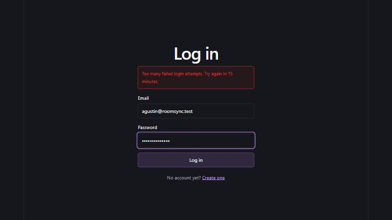

# Rate limiting on login and registration

The security control for Milestone 2 (#71). Before it, nothing limited
attempts on `POST /api/auth/login`, so a password could be guessed as fast as
bcrypt allows, and `POST /api/auth/register` could be used at any speed to
check which emails have accounts through its 409. This is OWASP A07,
Identification and Authentication Failures.

## What is limited

| Endpoint | Counted per | What counts | Default | Variable |
|---|---|---|---|---|
| `POST /api/auth/login` | Account email | Wrong passwords (401) | 5 per 15 minutes | `LOGIN_MAX_FAILURES_PER_EMAIL` |
| `POST /api/auth/login` | IP address | Wrong passwords (401) | 20 per 15 minutes | `LOGIN_MAX_FAILURES_PER_IP` |
| `POST /api/auth/register` | IP address | Every attempt | 10 per 15 minutes | `REGISTER_MAX_PER_IP` |

The window is `RATE_LIMIT_WINDOW_MINUTES` (default 15) for all three. Each
variable is optional. A value that isn't a positive whole number stops the
server at startup rather than letting it run without a limit.

- **Per email** stops a guessing run against one account, even from many
  addresses. The email is trimmed and lowercased first, the same as the login
  itself, so `Sam@Example.test ` and `sam@example.test` share one count.
- **Per IP** stops one address spraying guesses across many accounts, which
  the per-email limit can't see.
- **Only wrong passwords count against login.** A correct login uses up
  nothing, and a request already refused with 429 doesn't count either, so a
  burst against one account doesn't use up the IP's allowance and lock out
  everyone else on the same network.
- **Registration counts every attempt**, because probing for registered
  emails produces 409s, not successes.

A refused request gets `429` in the contract's error shape, with
`Retry-After` in seconds until the window resets, and a message the login and
registration screens show as-is:

```text
HTTP/1.1 429 Too Many Requests
RateLimit: "login-ip"; r=14; t=893
RateLimit: "login-email"; r=0; t=893
RateLimit-Policy: "login-ip"; q=20; w=900; pk=:YmIwY2Q1MTM2YWU1:
RateLimit-Policy: "login-email"; q=5; w=900; pk=:NmIzM2FlNTFkZTY5:
Retry-After: 893
Content-Type: application/json; charset=utf-8

{"error":{"code":"RATE_LIMITED","message":"Too many failed login attempts. Try again in 15 minutes."}}
```

The `RateLimit` and `RateLimit-Policy` headers (IETF draft 8) tell a client
how much allowance is left on each limit.

The code is in `server/src/middleware/rate-limit.ts`, applied in
`server/src/routes/auth.routes.ts`.

## Evidence

All runs were on October 7, 2026, against the dev server (`npm run dev`) with
the seed data loaded. The script is `server/scripts/login-burst.mjs`: 20
logins with a wrong password, printing each response.

### Before: `main` at `1dc8521`, no limit

```text
$ node scripts/login-burst.mjs 20
POST http://localhost:4000/api/auth/login x 20, email agustin@roomsync.test, wrong password

attempt  status  code                 retry-after
      1  401     INVALID_CREDENTIALS  -
      2  401     INVALID_CREDENTIALS  -
      3  401     INVALID_CREDENTIALS  -
      4  401     INVALID_CREDENTIALS  -
      5  401     INVALID_CREDENTIALS  -
      6  401     INVALID_CREDENTIALS  -
      7  401     INVALID_CREDENTIALS  -
      8  401     INVALID_CREDENTIALS  -
      9  401     INVALID_CREDENTIALS  -
     10  401     INVALID_CREDENTIALS  -
     11  401     INVALID_CREDENTIALS  -
     12  401     INVALID_CREDENTIALS  -
     13  401     INVALID_CREDENTIALS  -
     14  401     INVALID_CREDENTIALS  -
     15  401     INVALID_CREDENTIALS  -
     16  401     INVALID_CREDENTIALS  -
     17  401     INVALID_CREDENTIALS  -
     18  401     INVALID_CREDENTIALS  -
     19  401     INVALID_CREDENTIALS  -
     20  401     INVALID_CREDENTIALS  -

20 x 401
```

Twenty wrong passwords, twenty answers, and nothing slows them down.

### After: the same burst

```text
$ node scripts/login-burst.mjs 20
POST http://localhost:4000/api/auth/login x 20, email agustin@roomsync.test, wrong password

attempt  status  code                 retry-after
      1  401     INVALID_CREDENTIALS  -
      2  401     INVALID_CREDENTIALS  -
      3  401     INVALID_CREDENTIALS  -
      4  401     INVALID_CREDENTIALS  -
      5  401     INVALID_CREDENTIALS  -
      6  429     RATE_LIMITED         900
      7  429     RATE_LIMITED         900
      8  429     RATE_LIMITED         900
      9  429     RATE_LIMITED         900
     10  429     RATE_LIMITED         900
     11  429     RATE_LIMITED         900
     12  429     RATE_LIMITED         900
     13  429     RATE_LIMITED         900
     14  429     RATE_LIMITED         900
     15  429     RATE_LIMITED         900
     16  429     RATE_LIMITED         900
     17  429     RATE_LIMITED         900
     18  429     RATE_LIMITED         900
     19  429     RATE_LIMITED         900
     20  429     RATE_LIMITED         900

5 x 401, 15 x 429
```

The account allows 5 wrong passwords, then refuses for 15 minutes.

### Other users can still log in

Straight after that burst, from the same machine, with the seed password:

```text
$ # POST /api/auth/login with the right password for each account
agustin@roomsync.test  right password -> 429
marcus@roomsync.test   right password -> 200
```

The limited account is refused even with the right password, which is the
point: a guess that happens to be right after the limit is reached gets
nowhere. Marcus logs in normally.

### The per-IP limit

Next, a burst with a different email each time, as someone spraying guesses
across accounts would send:

```text
$ node scripts/login-burst.mjs 20 --spray
POST http://localhost:4000/api/auth/login x 20, a different email each time, wrong password

attempt  status  code                 retry-after
      1  401     INVALID_CREDENTIALS  -
      2  401     INVALID_CREDENTIALS  -
      3  401     INVALID_CREDENTIALS  -
      4  401     INVALID_CREDENTIALS  -
      5  401     INVALID_CREDENTIALS  -
      6  401     INVALID_CREDENTIALS  -
      7  401     INVALID_CREDENTIALS  -
      8  401     INVALID_CREDENTIALS  -
      9  401     INVALID_CREDENTIALS  -
     10  401     INVALID_CREDENTIALS  -
     11  401     INVALID_CREDENTIALS  -
     12  401     INVALID_CREDENTIALS  -
     13  401     INVALID_CREDENTIALS  -
     14  401     INVALID_CREDENTIALS  -
     15  401     INVALID_CREDENTIALS  -
     16  429     RATE_LIMITED         892
     17  429     RATE_LIMITED         892
     18  429     RATE_LIMITED         892
     19  429     RATE_LIMITED         892
     20  429     RATE_LIMITED         892

15 x 401, 5 x 429
```

Only 15 get through because the first burst's 5 wrong passwords already
counted against this IP: 20 in total, then 429. The 15 refusals in the first
burst did not count.

### Registration

Twelve sign-ups from one address, each invalid so nothing is written to the
database (registration counts every attempt, whatever its outcome):

```text
400 400 400 400 400 400 400 400 400 400 429 429
{"error":{"code":"RATE_LIMITED","message":"Too many sign-ups from this network. Try again in 15 minutes."}}
```

### The login screen

After five wrong passwords in the browser:



### Tests

`server/src/routes/auth.rate-limit.test.ts` covers both login limits, the
email normalization, successful logins not counting, refused attempts not
counting against the IP, other accounts still logging in, and the
registration limit. `server/src/middleware/rate-limit.test.ts` covers reading
the limits from the environment. The other test suites set the limits out of
reach in their Vitest configs, because every test logs in from one address.

## Seeing it yourself

With the database and the API running (README, Getting started):

```bash
cd server && node scripts/login-burst.mjs 20
```

Attempts 1 to 5 answer 401 and the rest 429. Then log in in the browser as a
different seed user, which works, and as `agustin@roomsync.test`, which shows
the message above. The counters are in memory, so restarting the server resets
them, and `npm run dev` restarts on every file save.

## Limits of this control

- **Someone can lock a known account for 15 minutes** by sending it five wrong
  passwords. That is the cost of a per-account limit, and it is accepted: the
  window is short, nothing is locked permanently, and the alternative leaves
  the account open to guessing from many addresses.
- **The counters are in memory, in one process.** That is right for how
  RoomSync runs today. If the Milestone 3 deployment runs more than one
  instance behind a load balancer, each would count separately and the real
  limit would multiply. It would then need a shared store, such as a table in
  PostgreSQL, or Redis.
- **The IP is `req.ip`.** In production Express trusts one proxy hop
  (`server/src/app.ts`), so `req.ip` is the client's address as that proxy
  reports it in `X-Forwarded-For`. Outside production no proxy is trusted, so
  a client can't pick its own address by sending that header.
- **Users behind a shared address**, such as a campus network, share the IP
  allowance with everyone else there. 20 wrong passwords per 15 minutes is
  generous for that, and only wrong passwords count.

## Library choice

`express-rate-limit` 8.7.0, MIT licensed, with two dependencies, `debug` and
`ip-address`. It is the standard limiter for Express, supports a custom key
(the email), can count only failed requests, and sets `Retry-After` and the
standard `RateLimit` headers.

- **Audit:** `npm audit --omit=dev` in `server/` reports the same 8 findings
  before and after installing it, and none of them is in its dependency tree.
  See [`dependency-audit.md`](./dependency-audit.md).
- **Version:** 8.7.0, from August 29, 2026, rather than 8.7.1, which was
  published the day before this change. Letting a release age a few weeks
  before adopting it is a cheap guard against a compromised publish. The
  lockfile pins it.
