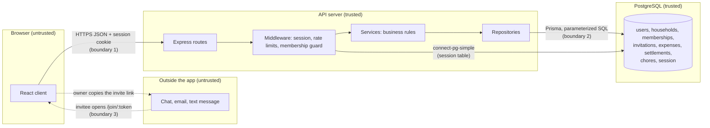

# Threat model

What an attacker could do to RoomSync, what already stops them, and what is
left. Written for Milestone 2 (#70) against `main` at `4173287` on October 9,
2026. Every mitigation names the file that implements it. The OWASP Top 10
review (#65) cross-references this document by threat ID.

## Scope and method

RoomSync is one React client, one Express API and one PostgreSQL database.
It records money owed between roommates; it never moves money. What it
protects:

- **Accounts:** email addresses, bcrypt password hashes, live sessions.
- **Household data:** who lives together, what they spent, what they owe each
  other, and their chores. Only members may see or change it.
- **The ledger's integrity:** balances are derived from expenses and
  settlements on every read, so a false record is a false balance.

Each surface below is checked with STRIDE: **S**poofing, **T**ampering,
**R**epudiation, **I**nformation disclosure, **D**enial of service, and
**E**levation of privilege. Likelihood and impact are Low, Medium or High,
judged for a course project with a handful of households, not for a bank.

## Data flow and trust boundaries

1. **Browser to API.** Everything the client sends is untrusted: the server
   re-checks identity, membership, roles and every amount, whatever the
   interface showed.
2. **API to PostgreSQL.** Only repositories reach the database (enforced by
   lint, `docs/architecture/layering-lint.md`), except the session store,
   which manages its own table. The database is trusted, but a copy of it
   would expose what it stores, which matters for sessions and invitations.
3. **Invitation links outside the app.** The link travels through channels
   RoomSync doesn't control, so whoever holds it is treated as untrusted until
   they log in and accept.

## Threats

### Registration, login and sessions

| ID | Threat | L | I | Existing mitigation | Residual risk | Decision |
|---|---|---|---|---|---|---|
| A1 | **S:** Guessing a password by trying many, or replaying leaked passwords from other sites | High | High | Login rate limit: 5 wrong passwords per account and 20 per IP per 15 minutes, then `429` (`middleware/rate-limit.ts`, #71). bcrypt at cost 10 (`services/auth.service.ts`). Passwords at least 8 characters (`services/validation.ts`) | A slow, distributed attack stays under both limits. A known account can be locked for 15 minutes by anyone. No breached-password check | **Mitigated** by #71, the implemented control. Lockout accepted: it is short and nothing is permanent |
| A2 | **I:** Learning which emails have accounts | Medium | Low | Login gives the same code, message and timing for an unknown email and a wrong password (`DUMMY_HASH`, `services/auth.service.ts`). Registration's `409` message is generic, and registration is limited to 10 per IP per 15 minutes (#71) | Registration's `409` status still confirms an address, one at a time (`api-contract.md`, register) | **Accept.** Closing it needs email verification, out of scope. The rate limit stops probing at speed |
| A3 | **S:** Session fixation: planting a session id before the victim logs in | Low | High | The session id is regenerated on login (`routes/auth.routes.ts`, `regenerateSession`) | None known | **Mitigated** |
| A4 | **I:** Stealing the session cookie | Low | High | `httpOnly` (no JavaScript access), `SameSite=Lax`, and `Secure` in production (`middleware/session.ts`). No `dangerouslySetInnerHTML` in the client, so React escapes all user text | No Content-Security-Policy as a second layer. A stolen cookie works until it expires: 14 days, with no idle timeout | **Accept** the lifetime for the MVP. Security headers go to #65 |
| A5 | **T:** Cross-site request forgery: another site posting with the user's cookie | Low | Medium | `SameSite=Lax` keeps the cookie off cross-site POSTs. The API parses only `application/json` bodies (`express.json()`, `app.ts`) and sends no CORS headers, so another origin can't send one without a preflight that fails | A browser that ignores `SameSite` | **Accept.** Every current browser enforces it |
| A6 | **S:** Forging a session cookie | Low | High | The cookie is signed with `SESSION_SECRET`. The server refuses to start without it, and refuses the example value in production (`middleware/session.ts`) | A leaked secret | **Mitigated.** The secret stays out of Git (`.gitignore` has `.env`) |
| A7 | **D:** Exhausting the CPU with bcrypt work | Medium | Medium | Failed logins and all registrations are rate-limited per IP (#71). Request bodies are capped at Express's 100 KB default | Many IPs together | **Accept** for the MVP |

### Household membership and authorization

| ID | Threat | L | I | Existing mitigation | Residual risk | Decision |
|---|---|---|---|---|---|---|
| H1 | **I/E:** Reading or changing another household's data by changing the id in the URL | Medium | High | Every `/households/:householdId` route runs `requireHouseholdMember` (`middleware/require-household-member.ts`), which checks the membership in the database on every request and answers `404` for a non-member, the same as a household that doesn't exist (`services/household.service.ts`, `requireMembership`). Integration tests check the 404 against PostgreSQL (`integration/household.integration.test.ts`) | None known | **Mitigated** |
| H2 | **E:** A member doing an owner-only action, such as inviting | Low | Medium | The role is read from the database per request, and `createInvitation` refuses a non-owner with `403` (`services/invitation.service.ts`). Integration-tested | None known | **Mitigated** |
| H3 | **T:** Joining two households at once by sending two requests together, breaking the one-household rule | Low | Medium | `createHousehold` and `acceptInvitation` check for an existing membership first (`services/household.service.ts`, `services/invitation.service.ts`) | The check and the insert are separate steps, and `memberships` is unique only per user *and* household (`prisma/schema.prisma`). Two simultaneous requests can both pass. Only the user's own account is affected | **Mitigate** in #73: a database constraint or a lock, with a concurrent integration test |
| H4 | **T/R:** A member recording a payment *between two other members*, wiping out a debt owed to someone else | Medium | Medium | The amount can't exceed what is owed (`EXCEEDS_BALANCE`, checked inside the transaction in `repositories/ledger.repository.ts`). Both members must belong to the household. The balances screen only offers payments that involve you (`client/src/pages/BalancesPage.tsx`) | The API accepts any pair of members (`services/settlement.service.ts`). The restriction is only in the interface, so a member using the API directly can record a payment they had no part in. Nothing records who entered it, so the false record can't be traced | **Mitigate:** require the requester to be the payer or the recipient, and store who recorded each settlement and expense (#90) |

### Invitation tokens

| ID | Threat | L | I | Existing mitigation | Residual risk | Decision |
|---|---|---|---|---|---|---|
| I1 | **S:** Guessing a valid invitation token to join a household | Low | High | 32 bytes from `crypto.randomBytes` (`services/invitation.service.ts`), 256 bits, so guessing is infeasible. Previewing and accepting both need a logged-in account (`routes/invitation.routes.ts`) | None in practice | **Mitigated** |
| I2 | **I/E:** A leaked link (forwarded chat, screenshot, shared device) used by the wrong person | Medium | High | Each link works once: accepting it is a conditional update, so two people can't both use it (`repositories/invitation.repository.ts`, `acceptIntoHousehold`). Links expire after 7 days (`INVITATION_LIFETIME_MS`). Whoever joins appears in the members list every member sees. Integration-tested for single use and expiry | Until it is used or expires, a leaked link lets anyone with an account join. The owner can't cancel a link yet, or remove the wrong person afterwards | **Mitigate** with #75 (revoke an invitation) and #74 (remove a member) in Sprint 4. Accept the 7-day window until then |
| I3 | **I:** Tokens read from a copy of the database | Low | Medium | Tokens are single-use and short-lived | Tokens are stored as-is (`prisma/schema.prisma`), so a database copy exposes the pending ones | **Accept.** Anyone with a database copy can already read every household's data. Hashing tokens is a cheap later improvement |
| I4 | **I:** Learning that a household exists from its name on the join screen | Low | Low | The preview shows only the household name and expiry, and only to a logged-in user holding the token (`services/invitation.service.ts`, `previewInvitation`) | The holder of a link learns the household's name, which the link was meant to share | **Accept** by design |

### Money writes: expenses and settlements

| ID | Threat | L | I | Existing mitigation | Residual risk | Decision |
|---|---|---|---|---|---|---|
| M1 | **T:** Amounts that break the arithmetic: fractions of a cent, negative or huge values, shares that don't add up | Medium | High | Money is integer cents only, positive and capped (`validateAmountCents`, `services/validation.ts`). Every split must sum exactly to the total, with no silent adjustment (`services/split.service.ts`, 41 tests). Payer and participants must be members (`services/expense.service.ts`) | None known | **Mitigated** |
| M2 | **T:** Overpaying a debt to invent a debt the other way, or racing two settlements past the balance check | Medium | Medium | The balance is recomputed inside the write's transaction under a per-household advisory lock, which expense creation also takes (`repositories/ledger.repository.ts`, `lockLedger`). Over the balance is `409 EXCEEDS_BALANCE` | None known | **Mitigated** |
| M3 | **T:** SQL injection through any field | Low | High | All queries go through Prisma, which sends values as parameters. The one raw statement, the advisory lock, uses Prisma's tagged template, which parameterizes too (`repositories/ledger.repository.ts`) | None known | **Mitigated.** #65 re-checks it under A03 |
| M4 | **R:** A member denying they entered an expense or a payment | Medium | Medium | Each expense records its payer, and each settlement its two members | Neither records *who entered it* (`prisma/schema.prisma`), so a record entered by one member on another's behalf can't be traced (see H4). There is no audit log | **Mitigate** in #90: store the recording member |
| M5 | **T:** Editing or deleting records to rewrite history | Low | Medium | There is no edit or delete yet, so records are append-only | US-12 (#60) adds editing and deleting expenses | **Revisit in #60:** only the person who created an expense should change it, and the change should keep a trace |

### The session store

| ID | Threat | L | I | Existing mitigation | Residual risk | Decision |
|---|---|---|---|---|---|---|
| S1 | **S:** Session ids read from a copy of the database and replayed | Low | High | The `session` table is only reachable through the database, which is not exposed outside the server | The store keeps the raw session id, so a database copy contains live sessions | **Accept**, for the same reason as I3: a database copy already exposes everything |
| S2 | **D:** Expired sessions piling up | Low | Low | Expired rows are swept hourly (`pruneSessionInterval`, `middleware/session.ts`). Anonymous visitors create no row (`saveUninitialized: false`) | None known | **Mitigated** |
| S3 | **T:** The session store bypassing the layering rule | Low | Low | The exception is documented (`server/src/repositories/README.md`) and allowed by name in the lint config; `connect-pg-simple` anywhere else fails CI | None known | **Mitigated** |
| S4 | **I:** Error responses or headers revealing internals | Medium | Low | Unexpected errors return a generic `500 INTERNAL_ERROR`, never the database message (`middleware/error-handler.ts`) | Express's `X-Powered-By` header is still sent, and no security headers are set | **Mitigate** in #65 (security misconfiguration) |

## The implemented control

The control for Milestone 2 is the rate limit on login and registration (#71,
[`rate-limiting.md`](./rate-limiting.md)). It addresses **A1**, password
guessing, and slows **A2**, probing which emails have accounts, and **A7**,
CPU exhaustion through bcrypt. Its before-and-after evidence is in that
document.

## Follow-up

| Threat | Action | Where |
|---|---|---|
| H3 | Make one-household-per-user atomic, with a concurrent test | #73 (Sprint 4) |
| H4, M4 | Require the requester to be the payer or recipient of a settlement; store who recorded each expense and settlement | #90 (Sprint 4) |
| I2 | Revoke an invitation; remove a member | #75, #74 (Sprint 4) |
| M5 | Ownership and a trace for edits and deletes | #60 (Sprint 4) |
| A4, S4 | Security headers, `X-Powered-By` | #65 |
| M3 | Re-check injection | #65 |

[`dependency-audit.md`](./dependency-audit.md) tracks third-party
vulnerabilities, including a `proxy-addr` advisory relevant to how `req.ip`
is resolved. The OWASP Top 10 review (#65) builds on both documents.
